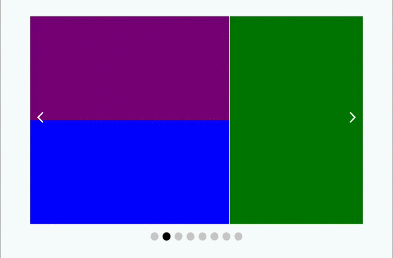

# slide.js

> A minimal jQuery plugin to slide html elements.





### Features

- around 3KB gzipped

- Keyboard navigation

- Lazy load of images

- Infinite loop

- Dot navigation

  ​

### Installation

bower : `bower install --save slide-js`

npm : `npm install --save slide-js`

**Manual**

``` html
<!--========== load css ===========-->
<link rel="stylesheet" href="path/to/jquery.slide.css">

<!--========== load js ============-->
<script src="http://ajax.googleapis.com/ajax/libs/jquery/2.0.0/jquery.min.js"></script>
<script src="path/to/jquery.slide.js"></script>
```

### HTML Structure

``` html
<div id="element">
  <ul>
    <li><div data-slide-src="x.jpg"></div></li>
    <li>
      <div data-slide-src="y.jpg"></div>
      <div data-slide-src="z.jpg"></div>
    </li>
  </ul>
</div>
```

### Advanced Options

``` javascript
var slider = $('#element').SlideJS({
  autoplay       	: false,
  autoplaySpeed  	: 3000,
  transitionSpeed	: 200,
  arrows			: true,
  dots				: true,
  loop				: false,
  lazyLoad			: false,
  pauseOnHover		: true,
  keyboard			: true
})
```

If you enable lazy load then the elements must have a `data-slide-src` attribute.

For example

``` html
<div id="element">
  <ul>
    <li><div data-slide-src="x.jpg"></div></li>
    <li>
      <div data-slide-src="y.jpg"></div>
      <div data-slide-src="z.jpg"></div>
    </li>
  </ul>
</div>
```

## Contributing

Before sending a pull request remember to follow [jQuery Core Style Guide](http://contribute.jquery.org/style-guide/js/).

1. Fork it!
2. Create your feature branch: `git checkout -b my-new-feature`
3. Make your changes on the `src` folder, never on the `dist` folder.
4. Commit your changes: `git commit -m 'Add some feature'`
5. Push to the branch: `git push origin my-new-feature`
6. Submit a pull request :D

### License

MIT
